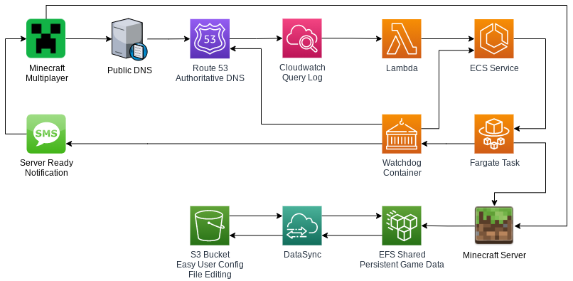

# minecraft-ondemand
Almost free serverless on-demand Minecraft server in AWS

## Background
Instead of paying a minecraft hosting service for a private server for you and your friends, host it yourself.  By utilizing several AWS services, a minecraft server can automatically start when you're ready to use it, and shut down when you are done.  The final cost will depend on use but can be as little as a a dollar or two per month.  The cost estimate breakdown is below.

## Workflow
The process works as follows:
1. Open Minecraft Multiplayer, let it look for our server, it will fail.
2. The DNS lookup query is logged in Route53 on our public hosted zone.
3. CloudWatch forwards the query to a Lambda function.
4. The Lambda function modifies an existing ECS Fargate service to a desired task count of 1.
5. Fargate launches two containers, Minecraft and a watchdog.
6. The watchdog optionally sends a text message through Twilio when the server is ready.
7. Refresh Minecraft server list, server is ready to connect.
8. After 10 minutes without a connection or 20 minutes after the last client disconnects (customizable) the watchdog sets the desired task count to zero and shuts down.

## Diagram


## Requirements
- AWS Account
- Domain name with public DNS served from Route53.  Does not need to be registered through Route53.
- Minecraft Java edition client (though it could probably be tweaked to work with bedrock edition)
- Use of the excellent [Minecraft Docker] server image (used within task definition, no direct download required)

## Cost Breakdown
- Link to [AWS Estimate] assuming 20 hours a month usage.
- tl;dr : $0.50 per month for DNS zones, $0.0149 (one point five cents) per hour for Fargate Spot or $0.049 (four point nine cents) per hour for regular Fargate.  All other costs negligible, a couple of pennies per month at most.
- tl;dr;tl;dt : $1.50 / month for 20 hours of play.

# Installation and Setup
One day, this could be a Cloud Deployment Kit script.  Until then, these steps are required.

## Region Selection
While it doesn't matter which region you decide to run your server in, **Route53 will only ship its logs to us-east-1**, which in turns means that the lambda function also has to be in us-east-1.  This lambda function can fire off the server in another region without issue, as long as the destination region is specified within the lambda function code.  For the purposes of this documentation, I'm using us-west-2 to run my server.

## VPC
A VPC with Subnets must exist in order for Fargate tasks to launch and for EFS shares to be mounted.  A subnet should exist in each availability zone so that Fargate (and Fargate Spot, if used) can properly launch the tasks in an AZ with plenty of capacity.  A security group for our task is required but is easiest configured when setting up the Task Definition below.

A [Default VPC] should do the trick, chances are you've already got one.

## Elastic File System
EFS is where the world data and server properties are stored, and persists between runs of the minecraft server.  Connecting to EFS and making changes is only possible by mounting it to an Linux based EC2 instance or by SFTP via AWS Transfer.

## IAM Round 1
The IAM Console is where we configure the roles and policies required to give access to the Task running the Minecraft server and the Lambda Function used to start it.

Ultimately we'll need to create:
- Role for the ECS Fargate Task
- Role for the Lambda function (Lambda will create this for us and we'll add permissions to it)
- Policy to read/write the EFS mount attached to the Task role (EFS ARN required to create this Policy)
- Policy to turn our ECS service and tasks on and off, attached to both the Task role and the Lambda role. (ECS cluster and service name required to create this Policy)
- Policy to update a DNS record in Route53, attached to the Task role. (Hosted Zone ID required to create this Policy)

### Role Generation
In the IAM console, create a new role for the ECS Fargate Task.

Call it something useful, like `ecs.task.minecraft-server`.  Three policies must be linked to this role, but we are only ready to create the first one now.

### EFS Policy
The first policy we need to create will allow for read/write access to our new EFS drive.  Call it `efs.rw.minecraft-data` and place the ARN from the EFS created earlier in the policy's resource line:
```json
{
    "Version": "2012-10-17",
    "Statement": [
        {
            "Effect": "Allow",
            "Action": [
                "elasticfilesystem:ClientMount",
                "elasticfilesystem:ClientWrite",
                "elasticfilesystem:DescribeFileSystems"
            ],
            "Resource": "arn:aws:elasticfilesystem:us-west-2:xxxxxxxxxxxx:file-system/fs-xxxxxxxx"
        }
    ]
}
```

## Elastic Container Service

### Cluster
Create a new "Networking Only" Cluster.  Call it `minecraft`.  Don't create a dedicated VPC for this.  Enabling Container Insights is optional but recommended for troubleshooting later, especially if you expect a lot of people to potentially connect and you want to view CPU or Memory usage.

### Task Definition
Create a new Task Definition called minecraft-server.
- Task Role: ecs.task.minecraft-server (or whatever you called it when creating it above)
- Network Mode: awsvpc (default)
- Requires compatibilities: fargate (default)
- Task Execution Role: ecsTaskExecutionRole (default)
- Task Memory: 2GB (good to start, increase later if needed)
- Task CPU: 1 vCPU (good to start, increase later if needed)

Skip containers temporarily and go down to Volumes.  Add a volume, call it `data`, volume type EFS.  Select the filesystem id created above, root directory `/minecraft` and click Add.

Scroll back up and add a container.  Call it `minecraft-server`.
- Image: itzg/minecraft-server
- Port Mappings: 25565 TCP
- Essential: NOT Checked (task stops with the watchdog container)
- Environment Variables.
  - `EULA` : `TRUE`
  - Any additional stuff you want from [Minecraft Docker Server Docs]
- Mount Points: `data` mounted to `/data`

Add a second container.  Call it `minecraft-ecsfargate-watchdog`.  If using Twilio to alert you when the server is ready, all four twilio variables must be specified.
- Image: doctorray/minecraft-ecsfargate-watchdog
- Essential: YES checked
- Environmental Variables
  - `CLUSTER` : `minecraft`
  - `SERVICE` : `minecraft-server`
  - `DNSZONE` : Route53 hosted zone ID
  - `SERVERNAME` : `minecraft.example.com`
  - `TWILIOFROM` : `+1XXXYYYZZZZ` (optional, your twilio number)
  - `TWILIOTO` : `+1XXXYYYZZZZ` (optional, your cell phone to get a text on)
  - `TWILIOAID` : Twilio account ID (optional)
  - `TWILIOAUTH` : Twilio auth code (optional)

Create task.

### Service
Within your `minecraft` cluster, create a new Service.  Under Capacity Provider, you've got a choice.  If you leave it default, your tasks will launch under the `FARGATE` strategy by default, which currently will run about 5 cents per hour.  You can switch it to Custom, enable only FARGATE_SPOT, and pay 1.5 cents per hour.  While this is cheaper, technically AWS can terminate your instance at any time if they need the capacity.  The watchdog is designed to intercept this termination command and shut down safely, so it's fine to use Spot to safe a few pennies, at the extremely low risk of game interruption.

Select your task definition and version created above.  Platform version can be `LATEST` or `1.4.0`.  Call the service name `minecraft-server` to match the policies and lambda function.  Number of tasks should be 0 (this is adjusted later on demand).  Everything else on this page is fine as default. Hit Next.

Select your VPC, and select _all of the subnets that your EFS was created in_ which is probably all of them.  Using all the subnets will also maximize your success of running Fargate Spot tasks.

For Security Group, click edit.  Let it create a new security group.  Change the default HTTP rule to `Custom TCP` and change the port to `25565` from `Anywhere`, which will allow anyone to connect to the server once it is online (they have to know the name of course!)  You could also restrict by known IP addresses but this is cumbersome to update regularly.  Tap save.

Ensure that "Auto-assign public IP" is `ENABLED` (this is default).  Tap `Next`, `Next`, and `Create Service`.

## IAM Round 2
Now that we know the cluster name and service name, we can create the IAM Policy for ECS control, and attach it to the Role we created earlier.

### ECS Policy
The Elastic Container Service task that launches the containers needs to be able to control itself, and understand which network interface is attached to it in order to properly update the DNS records, as well as turn itself off when it's not in use.  Within this policy we give full access for ECS to control its own service and correspoinding tasks, and describe all network interfaces in EC2.  Replace the `xxxxxxxxxxxx` below with the appriopriate account ID in your ARN.

Call this policy `ecs.rw.minecraft-service`.
```json
{
    "Version": "2012-10-17",
    "Statement": [
        {
            "Effect": "Allow",
            "Action": [
                "ecs:*"
            ],
            "Resource": [
                "arn:aws:ecs:us-west-2:xxxxxxxxxxxx:service/minecraft/minecraft-server",
                "arn:aws:ecs:us-west-2:xxxxxxxxxxxx:task/minecraft/*"
            ]
        },
        {
            "Effect": "Allow",
            "Action": [
                "ec2:DescribeNetworkInterfaces"
            ],
            "Resource": [
                "*"
            ]
        }
    ]
}
```
Attach this policy to the `ecs.task.minecraft-server` role created earlier.

## Lambda
A lambda function must exist that turns on your minecraft service.  We do this with a simple python function that change the "Tasks Desired" count from zero to one when it is invoked.

Because we are relying on Route53+CloudWatch to invoke the Lambda function, it *must* reside in the N. Virginia (us-east-1) region.

Create a new function using `Author from scratch`.  I've used Python 3.9 but the latest version available should be fine.  Call it something like `minecraft-launcher`.  The other defaults are fine, it will create an IAM role we will modify afterward.  We do not need to specify a VPC.

Once the function has been created and you're in the code editor, replace the contents of the default lambda_function.py with this:
```python
import json
import boto3

def lambda_handler(event, context):

  ecs = boto3.client('ecs', region_name='us-west-2')
  response = ecs.describe_services(
    cluster='minecraft',
    services=[
      'minecraft-server',
    ]
  )

  desired = response["services"][0]["desiredCount"]

  if desired == 0:
    ecs.update_service(
      cluster='minecraft',
      service='minecraft-server',
      desiredCount=1
    )
    print("Updated desiredCount to 1")
  else:
    print("desiredCount already at 1")
```
This file is also in this repository in the `lambda` folder.  Change the region, if needed, to the location of where your ECS Cluster is.  Then, click the `Deploy` button.  Finally, head over to the IAM console, locate the role that was created by this lambda function, and add the `ecs.rw.minecraft-service` policy to it so that it will actually work.

Lambda can be very inexpensive when used sparingly.  For example, this lambda function runs in about 1600ms when starting the container, and in about 500ms if the container is already online.  This means, running at a 128MB memory allocation, it will cost $0.00000336 the first time the server is launched from an off state, and about $0.00000105 every time someone connects to an online server, because anyone connecting will have to perform a DNS lookup which will trigger your lambda function.  If you and four friends played once a day for a month, it would come out to $0.0002583, which is 2.6% of a single penny.

## Route 53
Ensure that a domain name you own is set up in Route 53.  Add an A record with a 30 second TTL with a unique name that you will use to connect to your minecraft server.  Something like minecraft.example.com, or more complex if desired, as every time anyone _in the world_ performs a DNS lookup on this name, your Minecraft server will launch.

## IAM Route53 Policy
This policy gives permission to our ECS task to update the A record associated with our minecraft server.  Retrieve the hosted zone identifier from Route53 and place it in the Resource line within this policy.  Call it `route53.rw.yourdomainname`.

Note: This will give your container access to change _all_ records within the hosted zone, and this may not be desirable if you're using this domain for anything else outside of this purpose.  If you'd like to increase security, you can create a subdomain of the main domain for this purpose.  This is an advanced use case and the setup is described pretty well within [Delegate Zone Setup].
```json
{
    "Version": "2012-10-17",
    "Statement": [
        {
            "Effect": "Allow",
            "Action": [
                "route53:GetHostedZone",
                "route53:ChangeResourceRecordSets",
                "route53:ListResourceRecordSets"
            ],
            "Resource": "arn:aws:route53:::hostedzone/XXXXXXXXXXXXXXXXXXXXX"
        },
        {
            "Effect": "Allow",
            "Action": [
                "route53:ListHostedZones"
            ],
            "Resource": "*"
        }
    ]
}
```
Attach this policy to your ECS Task Role.

## CloudWatch

##

  [Default VPC]: <https://docs.aws.amazon.com/vpc/latest/userguide/default-vpc.html>
  [Minecraft Docker]: <https://hub.docker.com/r/itzg/minecraft-server>
  [AWS Estimate]: <https://calculator.aws/#/estimate?id=61e8ef3440b68927eb0da116e18628e3081875b6>
  [Minecraft Docker Server Docs]: <https://github.com/itzg/docker-minecraft-server/blob/master/README.md>
  [Delegate Zone Setup]: <https://stackoverflow.com/questions/47527575/aws-policy-allow-update-specific-record-in-route53-hosted-zone>
