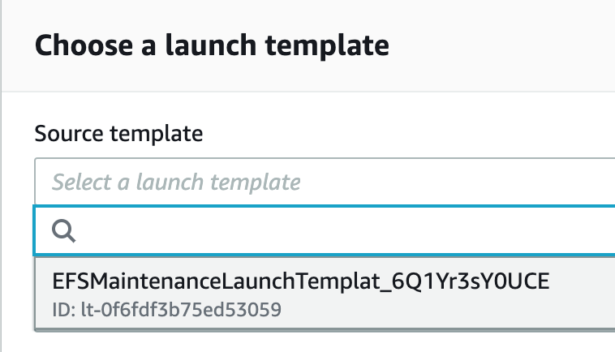

# minecraft-ondemand: AWS Cloud Development Kit (CDK)

> Quick and easy deployment of an on-demand Minecraft server with configurable
> settings using [AWS CDK](https://aws.amazon.com/cdk/).

## Requirements

- Node.js version 10 or later
- AWS Account
- AWS CLI installed and configured
- Domain name with public DNS served from Route 53
- an EC2 Key pair (optional)

**Note:** Installing CDK globally is not required.

## Usage

### 1. Clone the repository

Clone the `minecraft-ondemand` GitHub repository.

```bash
git clone https://github.com/doctorray117/minecraft-ondemand.git
```

### 2. Change to the CDK directory

```bash
cd cdk/
```

### 3. Set the required configuration values

Copy `.env.sample` at the root of this repo and save it as `.env`:

```bash
cp .env.sample .env
```

The only **required** configuration value is `DOMAIN_NAME`. This value should be
the domain name of your existing Route53 hosted zone. An NS record will be added
to this hosted zone after CDK creates a hosted zone to handle the
subdomain (defaults to `minecraft`).

See the section on [Configuration](#configuration) for more configuration options.

### 4. Build and Deploy

Build and deploy the solution by running:

```bash
npm run build && npm run deploy
```

## Configuration

Configuration values can all be passed in as environment variables or by using a 
`.env` file created from [`.env.sample`](./.env.sample). 


**Note:** Environment variables will take precedence over configuration values
set in `.env`.

| Config                        | Description                                                                                                                                                                                                                                                                                                                                                                                                                                                                                                                                                | Default              |
| ----------------------------- | ---------------------------------------------------------------------------------------------------------------------------------------------------------------------------------------------------------------------------------------------------------------------------------------------------------------------------------------------------------------------------------------------------------------------------------------------------------------------------------------------------------------------------------------------------------- | -------------------- |
| DOMAIN_NAME                   | **Required** Domain name of existing Route53 Hosted Zone.                                                                                                                                                                                                                                                                                                                                                                                                                                                                                                  | --                   |
| SUBDOMAIN_PART                | Name of the subdomain part to be used for creating a delegated hosted zone (minecraft.example.com) and an NS record on your existing (example.com) hosted zone. This subdomain should not already be in use.                                                                                                                                                                                                                                                                                                                                               | `minecraft`          |
| SERVER_REGION                 | The AWS region to deploy your minecraft server in.                                                                                                                                                                                                                                                                                                                                                                                                                                                                                                         | `us-east-1`          |
| MINECRAFT_EDITION             | Edition of Minecraft server to run. Accepted values are are `java` or `bedrock` for [Minecraft Java Docker] or [Minecraft Bedrock Docker], respectively.                                                                                                                                                                                                                                                                                                                                                                                                   | `java`               |
| STARTUP_MINUTES               | Number of minutes to wait for a connection after starting before terminating                                                                                                                                                                                                                                                                                                                                                                                                                                                                               | `10`                 |
| SHUTDOWN_MINUTES              | Number of minutes to wait after the last client disconnects before terminating                                                                                                                                                                                                                                                                                                                                                                                                                                                                             | `20`                 |
| USE_FARGATE_SPOT              | Sets the preference for Fargate Spot. <br /><br />If you set it as `false`, your tasks will launch under the `FARGATE` strategy which currently will run about 5 cents per hour. You can leave it as `true` to use `FARGATE_SPOT`, and pay 1.5 cents per hour. While this is cheaper, technically AWS can terminate your instance at any time if they need the capacity. The watchdog is designed to intercept this termination command and shut down safely, it's fine to use Spot to save a few pennies, at the extremely low risk of game interruption. | `true`               |
| TASK_MEMORY                   | The amount (in MiB) of memory used by the task running the Minecraft server.                                                                                                                                                                                                                                                                                                                                                                                                                                                                               | `2048`               |
| TASK_CPU                      | The number of cpu units used by the task running the Minecraft server.                                                                                                                                                                                                                                                                                                                                                                                                                                                                                     | `1024`               |
| VPC_ID                        | VPC ID to deploy your server in. When this value is not specified, a new VPC is automatically created by default.                                                                                                                                                                                                                                                                                                                                                                                                                                          | --                   |
| MINECRAFT_IMAGE_ENV_VARS_JSON | Additional environment variables to be passed to the [Minecraft Docker Server](https://github.com/itzg/docker-minecraft-server/blob/master/README.md) or [Minecraft Bedrock Docker](https://github.com/itzg/docker-minecraft-bedrock-server/blob/master/README.md). Value is specified as inline JSON.                                                                                                                                                                                                                                                     | `{ "EULA": "TRUE" }` |
| SNS_EMAIL_ADDRESS             | The email address you would like to receive server notifications at. <br /><br />If this value is specified, an SNS topic is created and you will receive email notifications each time the minecraft server is launched and ready.                                                                                                                                                                                                                                                                                                                        | --                   |
| TWILIO_PHONE_FROM             | Your twilio phone number. (i.e `+1XXXYYYZZZZ`)                                                                                                                                                                                                                                                                                                                                                                                                                                                                                                             | --                   |
| TWILIO_PHONE_TO               | Phone number to receive text notifications at.                                                                                                                                                                                                                                                                                                                                                                                                                                                                                                             | --                   |
| TWILIO_ACCOUNT_ID             | Twilio account ID.                                                                                                                                                                                                                                                                                                                                                                                                                                                                                                                                         | --                   |
| TWILIO_AUTH_CODE              | Twilio auth code.                                                                                                                                                                                                                                                                                                                                                                                                                                                                                                                                          | --                   |
| DEBUG                         | Enables debug mode.                                                                                                                                                                                                                                                                                                                                                                                                                                                                                                                                        | --                   |

## Cleanup

To remove all of the resources that were deployed on the deploy script run the
following command:

```bash
npm run destroy
```

Note: Unless you changed the related configuration values, **running this script
will delete everything deployed by this template including your minecraft server
data**.

Alternatively, you can delete the `minecraft-server-stack` first, then the
`minecraft-domain-stack` from the [AWS Console](https://console.aws.amazon.com/cloudformation/).

## Advanced Usage
### EFS Maintenance
1. Log into your AWS console's EC2 section for your chosen region.
2. From the top right corner choose to launch an instance from a launch template 
   1. If you have more than one version, pick the highest revision.
3. Select the launch template created by your stack 
4. Select the most recent x86 AMI 
5. Select the cheapest instance type 
6. Select your key pair to log in.
7. Select one of the public subnets created by your stack 
8. Change anything else you want (though the defaults should _just work_) and launch the instance 
9. Click the instance id to go to the lust of instances again and wait for your instance to show as running.
10. Once running clik the instance id to get the details of its external IP address 
11. Use ssh with your local key file to log in
```
ssh -i /path/to/key-file.pem  ec2-user@YOUR_INSTANCE_IP
```
12. The FS should mount under `/mnt/efs/fs1/minecraft` after a minute or two 
13. When you are done shut down the instance to terminate it
```
sudo shutdown now
```

**Example Commands**
1. Back-up world to a local machine
```
# On ec2 instance
cd /mnt/efs/fs1/minecraft/
tar cjvf world.tar.bz2 world
# on local machine
scp -i /path/to/key-file.pem  ec2-user@YOUR_INSTANCE_IP:/mnt/efs/fs1/minecraft/world.tar.bz2 .
```
2. Upload a world from a local machine
```
# on local machine
scp -i /path/to/key-file.pem world.tar.bz2 ec2-user@YOUR_INSTANCE_IP:/mnt/efs/fs1/minecraft/
# On ec2 instance
cd /mnt/efs/fs1/minecraft/
rm -rf world
tar xjvf world.tar.bz2
```
3. Remove everything but the world and backups (useful for modded server version changes).
```
# On ec2 instance
cd /mnt/efs/fs1/minecraft/
shopt -s extglob
rm -rfv !("backups"|"world")
rm .ftb-installed
shopt -u extglob
```

## FAQ

## Troubleshooting

Set the `DEBUG` value in your [configuration](#configuration) to `true` to enable the following:

- CloudWatch Logs for the `minecraft-server` ECS Container
- CloudWatch Logs for the `minecraft-ecsfargate-watchdog` ECS Container

### The specified hosted zone does not exist

**Error Message:**

> The specified hosted zone does not exist. (Service: AmazonRoute53; Status Code: 404; Error Code: NoSuchHostedZone;...

**Cause:**

CDK is unable to find a Hosted Zone created with the domain matching your value
set to `DOMAIN_NAME`.

**Troubleshoot:**

Check the [Hosted Zones](https://console.aws.amazon.com/route53/v2/hostedzones#)
tab in the AWS Console and make sure the configuration value set for `DOMAIN_NAME`
matches the domain name found in the console.
